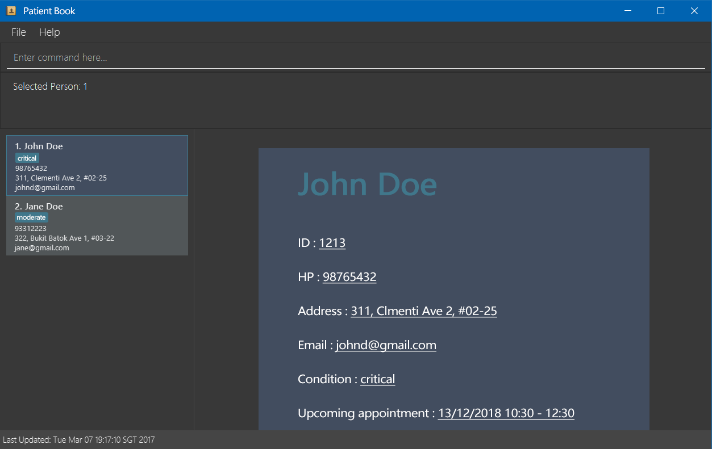
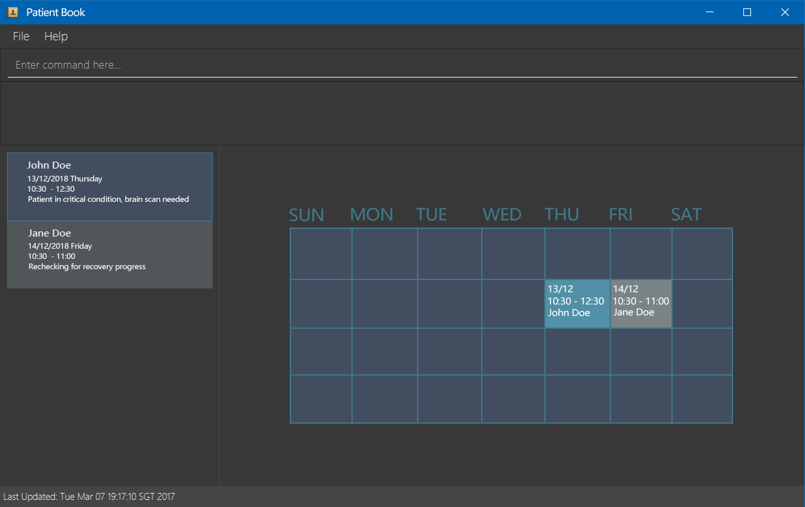

= Patient Book
ifdef::env-github,env-browser[:relfileprefix: docs/]

https://ci.appveyor.com/project/damithc/addressbook-level4[image:https://ci.appveyor.com/api/projects/status/3boko2x2vr5cc3w2?svg=true[Build status]]
https://coveralls.io/github/se-edu/addressbook-level4?branch=master[image:https://coveralls.io/repos/github/se-edu/addressbook-level4/badge.svg?branch=master[Coverage Status]]
https://www.codacy.com/app/damith/addressbook-level4?utm_source=github.com&utm_medium=referral&utm_content=se-edu/addressbook-level4&utm_campaign=Badge_Grade[image:https://api.codacy.com/project/badge/Grade/fc0b7775cf7f4fdeaf08776f3d8e364a[Codacy Badge]]
https://gitter.im/se-edu/Lobby[image:https://badges.gitter.im/se-edu/Lobby.svg[Gitter chat]]
image:https://img.shields.io/vscode-marketplace/r/ritwickdey.LiveServer.svg[Visual Studio Marketplace]
image:https://img.shields.io/beerpay/hashdog/scrapfy-chrome-extension.svg[Beerpay]

ifdef::env-github[]

endif::[]

ifndef::env-github[]
image::images/Ui.png[width="600"]
endif::[]

ifdef::env-github[]

endif::[]

ifndef::env-github[]
image::images/Ui2.png[width="600"]
endif::[]

* This is a desktop Patient Book application. It has a GUI but most of the user interactions happen using a CLI (Command Line Interface).
* It is a Java application intended for doctors to arrange information of their patients and appointment schedules.
* It is *written in OOP fashion*.

== Site Map

* <<UserGuide#, User Guide>>
* <<DeveloperGuide#, Developer Guide>>
* <<AboutUs#, About Us>>
* <<ContactUs#, Contact Us>>

== Acknowledgements

* Some parts of this sample application were inspired by the excellent http://code.makery.ch/library/javafx-8-tutorial/[Java FX tutorial] by
_Marco Jakob_.
* Libraries used: https://github.com/TestFX/TestFX[TextFX], https://bitbucket.org/controlsfx/controlsfx/[ControlsFX], https://github.com/FasterXML/jackson[Jackson], https://github.com/google/guava[Guava], https://github.com/junit-team/junit5[JUnit5]
* Original source code was adopted from https://github.com/se-edu/ (addressbook-level4)

== Licence : link:LICENSE[MIT]
